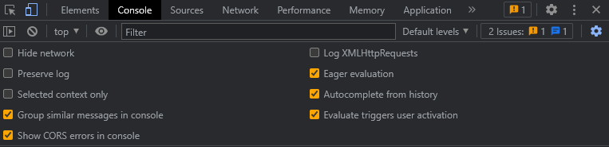
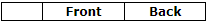

## Welcome

## deleting a tab "Interior" from rack
If you want to delete a tab, you can use this script
## Usage

Copy this code:
	

   
```javascript

    try {
        var container = $('.rack').children('tbody');
        var first_value = $(container).children('tr:nth(0)');
        $(first_value).children('th:nth(2)').remove();
        var last_value = $(container).children('tr:last');
        $(last_value).children('th:nth(2)').remove();
        var current = container[0].childNodes;
        $(container).children().each(function () {
            $(this).children('td:nth(1)').remove();
        });
    }
    catch (err) {
        console.log(err);
    }
```


Now you can paste it into your console, for a one-time use




#### if you want to constantly and automatically use this script, then you will inevitably do the following:
1. > **connect** via ssh to your server, or if it is local then just go to the folder with the site.
2. > or you do not have a** local server**, then find the directory where racktables was installed
3.  > in the js folder of the wwwroot directory, find the racktables.js script
4.  > Paste the code below at the end of the file and save it
5.  > **Ready**

### code to paste:
```javascript
window.onload = function () {
    try {
        var container = $('.rack').children('tbody');
        var first_value = $(container).children('tr:nth(0)');
        $(first_value).children('th:nth(2)').remove();
        var last_value = $(container).children('tr:last');
        $(last_value).children('th:nth(2)').remove();
        var current = container[0].childNodes;
        $(container).children().each(function () {
            $(this).children('td:nth(1)').remove();
        });
    }
    catch (err) {
        console.log(err);
    }
}
```

